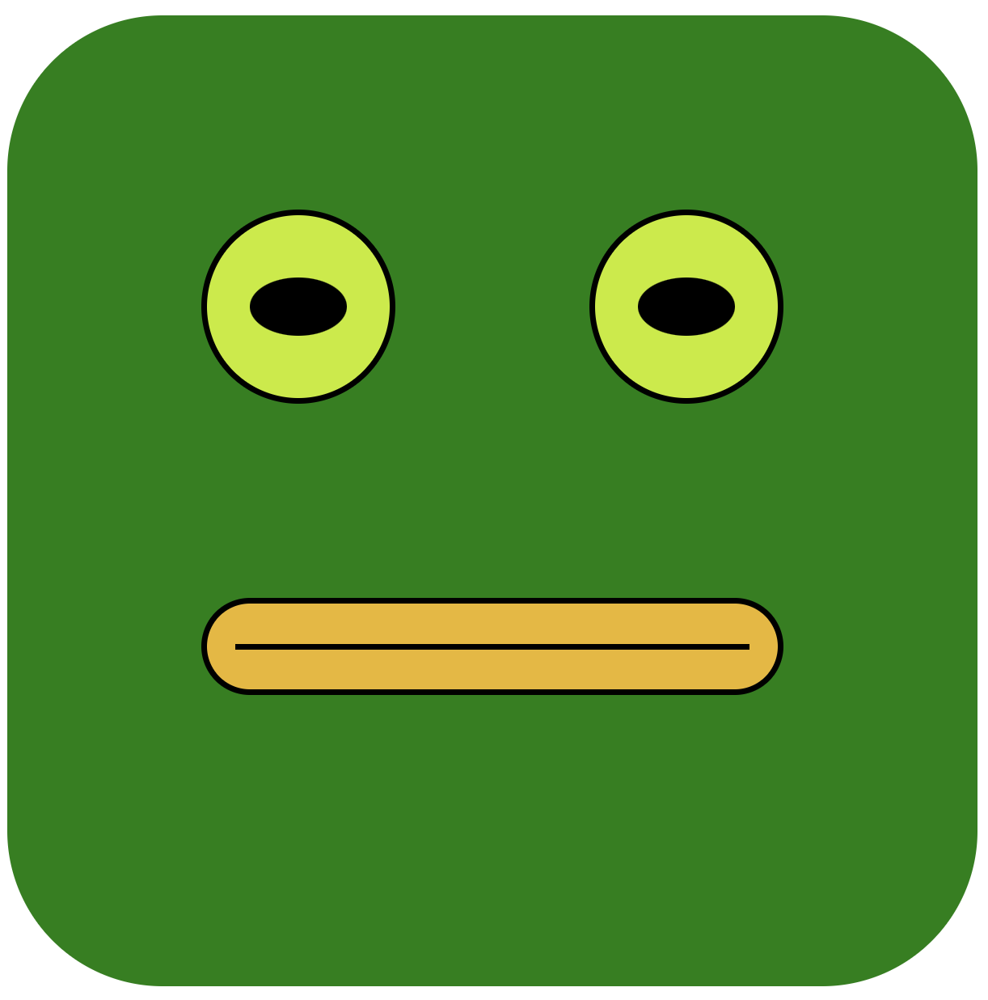
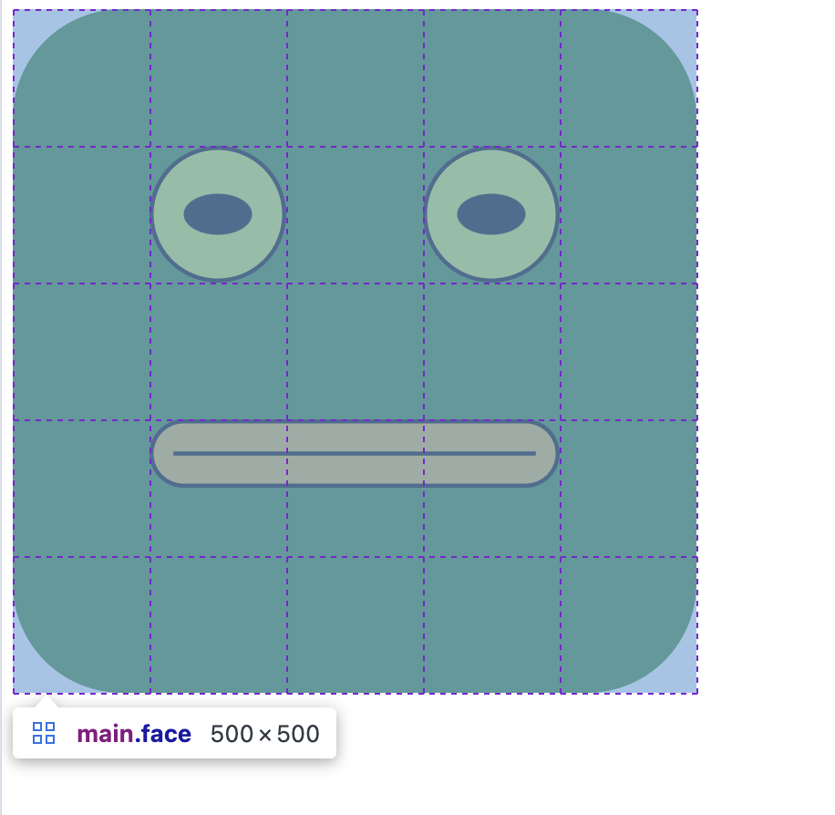

# Mr.Froggy Grid

Erstelle das Froschgesicht so wie in der Abbildung.
Verändere nur die style.css Datei, nicht das HTML.

Setze Gesicht (`.face`) auf `display: grid;`. Es soll `500px` breit sein und aus 5 Spalten (jeweils `100px`) und 5 Reihen (jeweils `100px`) bestehen.

Ordne die Gesichtsteile (Augen und Mund) wie im unteren Screenshots (erstellt mit Chrome Dev Tools Untersuchungs Modus) an.

